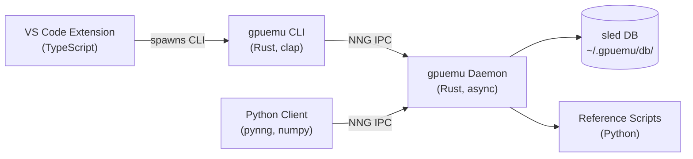
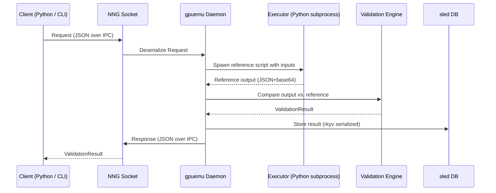
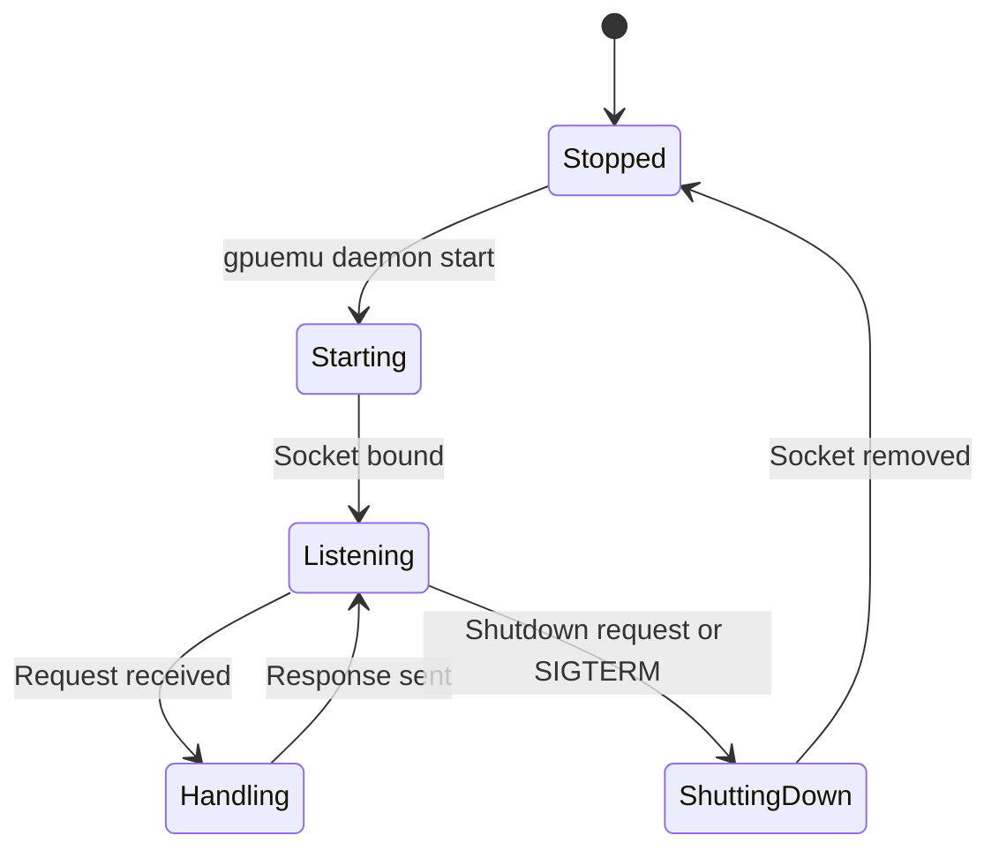

# Architecture

gpuemu is a modular toolchain for validating GPU kernel correctness on CPU. This page describes the system architecture, component roles, data flow, and IPC protocol.

---

## Four Components

gpuemu consists of four independent components that communicate via IPC and CLI invocations.

| Component | Language | Transport | Role |
|-----------|----------|-----------|------|
| **Daemon** (`gpuemu-daemon`) | Rust | NNG REP socket on Unix domain socket | Validation server: runs reference scripts, compares outputs, stores results in sled |
| **CLI** (`gpuemu`) | Rust (clap) | Spawns daemon, sends NNG REQ messages | User-facing command-line interface for testing, fuzzing, CI, and daemon control |
| **Python Client** (`gpuemu`) | Python (pynng, numpy) | NNG REQ socket | Programmatic validation from Python; framework adapters for PyTorch, JAX, TensorFlow |
| **VS Code Extension** (`vscode-gpuemu`) | TypeScript | Invokes CLI commands | Editor integration: diagnostics, code actions, test explorer, on-save validation |



---

## Technology Stack

gpuemu leverages a focused set of technologies chosen for performance and cross-language compatibility.

=== "Core (Rust)"

    | Crate | Purpose |
    |-------|---------|
    | `nng` | NNG REP/REQ sockets for IPC |
    | `sled` | Embedded key-value database for result and artifact storage |
    | `rkyv` | Zero-copy deserialization for internal storage (sled values) |
    | `serde` / `serde_json` | JSON serialization for the IPC wire protocol |
    | `blake2` | Blake2b hashing for deterministic seed derivation |
    | `tokio` | Async runtime for the daemon event loop |
    | `clap` | CLI argument parsing |
    | `toml` | Configuration file parsing (`gpuemu.toml`) |

=== "Python"

    | Package | Purpose |
    |---------|---------|
    | `pynng` | NNG REQ socket for daemon communication |
    | `numpy` | Tensor representation, encoding/decoding, tolerance math |
    | `base64` | Tensor data encoding for the JSON+base64 wire format |

=== "VS Code"

    | Technology | Purpose |
    |------------|---------|
    | TypeScript | Extension runtime |
    | VS Code Extension API | Diagnostics, code actions, test explorer |
    | Child process | Spawns `gpuemu` CLI for daemon interaction |

---

## Data Flow

A validation run follows a five-stage pipeline: **Build, Mirror, Validate, Inspect, Report**.



The stages map to the following operations:

1. **Build** -- The client prepares input tensors and computes the op output (on GPU or CPU).
2. **Mirror** -- The daemon runs the reference script on CPU to produce the expected output.
3. **Validate** -- The validation engine compares the op output against the reference: shape check, dtype check, value comparison with per-dtype tolerances, NaN/Inf detection, and invariant checks.
4. **Inspect** -- (Optional) Artifact inspection analyzes PTX/SASS for register pressure, spills, and forbidden patterns.
5. **Report** -- Results are stored in sled, returned to the client, and optionally exported as JUnit/JSON for CI.

---

## Seven Core Components

gpuemu's internal architecture is organized into seven logical components.

### 1. Kernel Contract

The configuration layer defined by `gpuemu.toml`. Each op or kernel declares its name, reference script path, execution mode, tolerances, and invariants. The `GpuemuConfig` struct in `gpuemu-common` parses and validates this contract.

### 2. CPU Mirror Runner (Executor)

The `Executor` spawns Python reference scripts as child processes. It serializes inputs as JSON with base64-encoded tensor data on stdin, and reads the reference output from stdout. A configurable timeout (default: 60 seconds) prevents runaway scripts.

### 3. Reference Implementations

Python scripts that provide canonical CPU implementations of each op. Scripts follow a strict JSON+base64 stdin/stdout protocol. See [Reference Scripts](reference-scripts.md) for details.

### 4. Validation Engine

The `Validator` compares the op output against the reference output through an ordered pipeline of checks: shape, dtype, value tolerance, NaN detection, Inf detection, and invariant enforcement. It tracks both max absolute diff and max relative diff.

### 5. Artifact Inspector

The artifact subsystem parses PTX/SASS output to extract metrics (register count, spill count, shared/local memory usage, instruction count). It lints these metrics against configurable policies and supports baseline diffing to detect regressions.

### 6. Policy Layer

Policies control CI behavior. The `PolicyConfig` defines whether to fail on regressions (`fail_on_regression`) and the warning threshold for metric changes (`warn_threshold`). Policies are evaluated during CI runs and artifact diffs.

### 7. CLI + Client Libraries

The CLI (`gpuemu`) provides subcommands for daemon control, validation, fuzzing, reproduction, minimization, artifact inspection, and CI. The Python client (`gpuemu`) exposes the same functionality as a programmatic API, with framework-specific adapters.

---

## Daemon Lifecycle

The daemon is a long-running process that listens for IPC requests and manages persistent state.



### Starting the daemon

```bash
gpuemu daemon start
```

This creates the state directory and starts listening:

- **Socket**: `~/.gpuemu/gpuemu.sock` (Unix domain socket via NNG IPC)
- **Database**: `~/.gpuemu/db/` (sled embedded database)
- **Config**: Loaded from `gpuemu.toml` in the current or ancestor directory

### Checking status

```bash
gpuemu status
```

Sends a `Ping` request to the daemon and displays the version, protocol version, and uptime.

### Stopping the daemon

```bash
gpuemu daemon stop
```

Sends a `Shutdown` request. The daemon finishes any in-flight request, removes the socket file, and exits.

!!! info "Automatic cleanup"
    If the socket file exists from a previous crashed daemon, the server removes it before binding. Stale socket files do not prevent startup.

---

## IPC Protocol

All communication between clients and the daemon uses **JSON-encoded messages over NNG REP/REQ sockets**.

### Protocol version

The current protocol version is **1** (`PROTOCOL_VERSION = 1`). Clients check the protocol version on first connection via the `Ping`/`Pong` handshake. A version mismatch raises a `ClientError` with instructions to upgrade.

### Message format

Messages are JSON objects with a `type` field that determines the message variant.

=== "Request"

    ```json
    {
      "type": "ValidateOp",
      "op_name": "my_matmul",
      "inputs": {
        "a": {
          "shape": [4, 8],
          "strides": [8, 1],
          "dtype": "float32",
          "data": "<base64-encoded bytes>"
        }
      },
      "output": {
        "shape": [4, 8],
        "strides": [8, 1],
        "dtype": "float32",
        "data": "<base64-encoded bytes>"
      },
      "kwargs": {}
    }
    ```

=== "Response (Success)"

    ```json
    {
      "type": "ValidationResult",
      "result": {
        "passed": true,
        "seed": 1234567890,
        "op_name": "my_matmul",
        "max_diff": 1.2e-7,
        "max_rel_diff": 3.4e-6,
        "failures": [],
        "timestamp": 1700000000,
        "duration_ms": 42,
        "repro_info": null
      }
    }
    ```

=== "Response (Error)"

    ```json
    {
      "type": "Error",
      "code": "OpNotFound",
      "message": "Op 'bad_name' not found in configuration. Available ops: my_matmul"
    }
    ```

### Request types

| Request | Description |
|---------|-------------|
| `Ping` | Health check; returns version, protocol version, uptime |
| `Shutdown` | Request daemon shutdown |
| `ValidateOp` | Validate an op output against its reference |
| `GetResult` | Retrieve a stored result by seed |
| `ListResults` | List recent validation results |
| `StoreBaseline` / `CompareBaseline` | Baseline management for regression detection |
| `FuzzOp` | Run fuzz testing with seeded random inputs |
| `Reproduce` | Reproduce a specific failure by seed |
| `Minimize` | Minimize a failing test case (binary search on dims or values) |
| `ListFailures` | List stored failures |
| `LintKernel` | Lint PTX content against artifact policies |
| `StoreArtifact` / `GetArtifact` / `ListArtifacts` | Artifact metrics management |
| `StoreArtifactBaseline` / `DiffArtifactBaseline` | Artifact baseline diffing |
| `RunCi` / `GetCiSummary` | CI integration |
| `GetTestCase` / `GetTestBatch` | Daemon-orchestrated test case generation |
| `SubmitOutput` | Submit op output for validation (daemon-orchestrated mode) |

### Error codes

| Code | Meaning |
|------|---------|
| `OpNotFound` | Op name not in `gpuemu.toml` |
| `KernelNotFound` | Kernel name not in config |
| `ReferenceScriptFailed` | Reference script exited with non-zero status |
| `InvalidRequest` | Malformed JSON or unknown request type |
| `InternalError` | Daemon-side error (storage, executor) |
| `NotFound` | Requested seed/result/baseline does not exist |
| `ConfigError` | Configuration parsing or loading error |
| `ArtifactNotFound` | No stored artifact for the kernel |
| `BaselineNotFound` | Named baseline does not exist |
| `PtxParseError` | Failed to parse PTX content |
| `CuobjdumpNotAvailable` | `cuobjdump` binary not found |
| `VersionMismatch` | Client/daemon protocol version mismatch |
