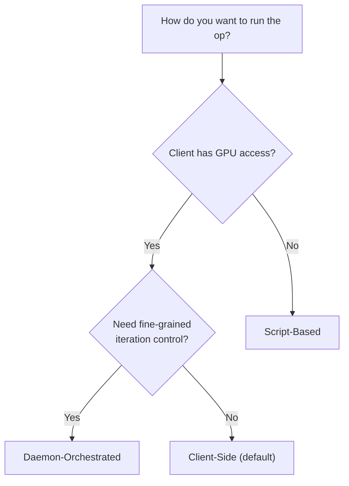

# Execution Modes

gpuemu supports three execution modes that control where the op under test runs and how inputs are generated. Each mode serves a different workflow, from interactive GPU development to fully automated CI pipelines.

---

## Overview

```mermaid
graph TB
    subgraph "Client-Side (default)"
        CS_Client["Client (GPU)"] -->|"1. Run op on GPU"| CS_Output["Op Output"]
        CS_Client -->|"2. Send inputs + output"| CS_Daemon["Daemon"]
        CS_Daemon -->|"3. Run reference script"| CS_Ref["Reference Output"]
        CS_Daemon -->|"4. Compare"| CS_Result["ValidationResult"]
    end

    subgraph "Daemon-Orchestrated"
        DO_Daemon["Daemon"] -->|"1. Generate test case"| DO_Client["Client (GPU)"]
        DO_Client -->|"2. Run op"| DO_Output["Op Output"]
        DO_Client -->|"3. Submit output"| DO_Daemon
        DO_Daemon -->|"4. Run reference + Compare"| DO_Result["ValidationResult"]
    end

    subgraph "Script-Based"
        SB_Daemon["Daemon"] -->|"1. Spawn op script"| SB_Op["Op Script"]
        SB_Daemon -->|"2. Spawn reference script"| SB_Ref["Ref Script"]
        SB_Op -->|"Output"| SB_Compare["Compare"]
        SB_Ref -->|"Output"| SB_Compare
        SB_Compare --> SB_Result["ValidationResult"]
    end
```



---

## 1. Client-Side Mode

**Default mode.** The client generates or receives inputs, runs the op on GPU (or CPU), and sends both inputs and output to the daemon for validation. The daemon only runs the reference script and compares results.

!!! tip "When to use"
    Use Client-Side mode when you have GPU access on the client machine and want the simplest integration path. This is the recommended starting point.

### How it works

1. The client creates input tensors (manually or via framework adapters).
2. The client runs the op under test to produce an output tensor.
3. The client calls `validate_op()`, which sends inputs and output to the daemon.
4. The daemon runs the reference script with the same inputs.
5. The daemon compares the op output against the reference output.
6. The daemon returns a `ValidationResult` to the client.

### Configuration

```toml title="gpuemu.toml"
[[ops]]
name = "my_relu"
reference = "scripts/ref_relu.py"
input_names = ["x"]
execution_mode = "client_side"   # This is the default
```

### Python example

```python title="client_side_example.py"
import numpy as np
from gpuemu_py import Client
from gpuemu_py.validate import validate_op

client = Client()

# Prepare inputs
x = np.random.randn(32, 128).astype(np.float32)

# Run your op (on GPU or CPU)
output = np.maximum(x, 0)  # Example: ReLU

# Validate against reference
result = client.validate_op("my_relu", {"x": x}, output)
print(f"Passed: {result.passed}, max_diff: {result.max_diff:.2e}")
```

Or using the context manager:

```python title="client_side_context.py"
from gpuemu_py import Client
from gpuemu_py.validate import validate_op

client = Client()
x = np.random.randn(32, 128).astype(np.float32)

with validate_op(client, "my_relu", inputs={"x": x}) as ctx:
    ctx["output"] = np.maximum(x, 0)
# Raises ValidationError if validation fails
```

### Client-Side fuzzing

For fuzz testing with Client-Side mode, use `fuzz_op_client_side()`. The daemon generates test cases, but the client executes the op:

```python title="client_side_fuzz.py"
from gpuemu_py import Client

client = Client()

def run_my_op(inputs):
    """Your GPU kernel wrapper."""
    return np.maximum(inputs["x"], 0)

results = client.fuzz_op_client_side(
    "my_relu",
    run_op=run_my_op,
    iterations=100,
    seed=42,
)

print(f"Passed: {results.passed}/{results.total}")
for failure in results.failures:
    print(f"  Seed {failure.seed}: {failure.failures[0]['message']}")
```

---

## 2. Daemon-Orchestrated Mode

The daemon generates test cases (seed, inputs, shape, dtype, layout) and returns them to the client. The client fetches cases, runs the op, and submits each output back to the daemon for validation.

!!! tip "When to use"
    Use Daemon-Orchestrated mode when you need fine-grained control over the test loop -- for example, to batch GPU executions, apply custom preprocessing, or integrate with a test framework that manages iteration.

### How it works

1. The client requests a test case (or batch) from the daemon via `get_test_case()` or `get_test_batch()`.
2. The daemon generates random inputs using its fuzzer and returns them with metadata (seed, shape, dtype, layout).
3. The client runs the op under test with the provided inputs.
4. The client submits the output via `submit_output()`.
5. The daemon runs the reference script, compares, and returns a `ValidationResult`.

### Configuration

```toml title="gpuemu.toml"
[[ops]]
name = "my_matmul"
reference = "scripts/ref_matmul.py"
input_names = ["a", "b"]
execution_mode = "daemon_orchestrated"
```

### Python example -- single test case

```python title="daemon_orchestrated_single.py"
from gpuemu_py import Client

client = Client()

# 1. Fetch a test case from the daemon
test_case = client.get_test_case("my_matmul", seed=42)

print(f"Seed: {test_case['seed']}")
print(f"Shape: {test_case['shape']}")
print(f"DType: {test_case['dtype']}")

# 2. Run your op with the generated inputs
a = test_case["inputs"]["a"]
b = test_case["inputs"]["b"]
output = a @ b  # Your GPU matmul here

# 3. Submit the output for validation
result = client.submit_output(
    "my_matmul",
    test_case["inputs"],
    output,
    seed=test_case["seed"],
)

print(f"Passed: {result.passed}, max_diff: {result.max_diff:.2e}")
```

### Python example -- batch test cases

```python title="daemon_orchestrated_batch.py"
from gpuemu_py import Client

client = Client()

# Fetch a batch of 50 test cases
cases = client.get_test_batch("my_matmul", count=50, seed=42)

passed = 0
failed = 0

for case in cases:
    a = case["inputs"]["a"]
    b = case["inputs"]["b"]
    output = a @ b  # Your GPU matmul

    result = client.submit_output(
        "my_matmul",
        case["inputs"],
        output,
        seed=case["seed"],
    )

    if result.passed:
        passed += 1
    else:
        failed += 1
        print(f"FAIL seed={case['seed']}: {result.failures[0]['message']}")

print(f"Results: {passed} passed, {failed} failed out of {len(cases)}")
```

---

## 3. Script-Based Mode

The daemon spawns both the reference script and a separate op script, feeding the same inputs to both. No client-side execution is needed. Both scripts use the same JSON+base64 stdin/stdout protocol.

!!! tip "When to use"
    Use Script-Based mode when the op can be invoked from a script (without interactive GPU access on the client), or in CI environments where you want a fully self-contained validation pipeline.

### How it works

1. The daemon generates test case inputs (during fuzzing or CI).
2. The daemon spawns the **reference script** and the **op script** as separate Python subprocesses.
3. Both scripts receive the same JSON+base64 input on stdin.
4. Both scripts write their output as JSON+base64 to stdout.
5. The daemon compares the two outputs using the validation engine.

### Configuration

```toml title="gpuemu.toml"
[[ops]]
name = "my_softmax"
reference = "scripts/ref_softmax.py"
op_script = "scripts/run_softmax.py"   # Required for script-based mode
input_names = ["x"]
execution_mode = "script_based"
```

!!! warning "op_script is required"
    In Script-Based mode, you must provide the `op_script` path. Without it, the daemon has no way to execute the op under test, and fuzz runs will fall back to comparing the reference against itself.

### Op script format

The op script follows the same protocol as reference scripts (JSON on stdin, JSON on stdout):

```python title="scripts/run_softmax.py"
#!/usr/bin/env python3
"""Op script: runs the actual softmax implementation under test."""
import sys
import json
import base64
import numpy as np

def decode_tensor(tensor_dict):
    shape = tensor_dict["shape"]
    dtype = np.dtype(tensor_dict["dtype"])
    data = base64.b64decode(tensor_dict["data"])
    return np.frombuffer(data, dtype=dtype).reshape(shape)

def encode_tensor(arr):
    return {
        "shape": list(arr.shape),
        "dtype": str(arr.dtype),
        "data": base64.b64encode(arr.tobytes()).decode("utf-8"),
    }

if __name__ == "__main__":
    payload = json.load(sys.stdin)
    inputs = {
        name: decode_tensor(t)
        for name, t in payload["inputs"].items()
    }
    kwargs = payload.get("kwargs", {})

    x = inputs["x"]
    # Your custom softmax implementation
    e_x = np.exp(x - np.max(x, axis=-1, keepdims=True))
    output = e_x / e_x.sum(axis=-1, keepdims=True)

    json.dump(encode_tensor(output), sys.stdout)
```

### Running script-based fuzzing

Script-Based mode is driven entirely from the CLI or CI:

```bash
# Fuzz with 200 iterations
gpuemu fuzz my_softmax --iterations 200 --seed 42

# Run CI validation
gpuemu ci run
```

No Python client code is needed on the client side.

---

## Comparison Table

| Feature | Client-Side | Daemon-Orchestrated | Script-Based |
|---------|:-----------:|:-------------------:|:------------:|
| **Default mode** | Yes | No | No |
| **Client runs op** | Yes | Yes | No |
| **Daemon runs op** | No | No | Yes (via op_script) |
| **Client needs GPU** | Typically | Typically | No |
| **Input generation** | Client or daemon | Daemon | Daemon |
| **Iteration control** | Client | Client | Daemon |
| **Requires `op_script`** | No | No | Yes |
| **Best for** | Interactive dev, pytest | Custom test loops, batching | CI pipelines, no-GPU environments |
| **Python client needed** | Yes | Yes | No (CLI only) |
| **Framework adapters** | Supported | Supported | N/A |

---

## Choosing a Mode



!!! note "Mixing modes"
    Different ops can use different execution modes in the same `gpuemu.toml`. For example, GPU-only ops can use Client-Side mode while CPU-testable ops use Script-Based mode.

### Quick recommendations

- **Starting out**: Use **Client-Side** mode. It requires the least configuration and works with the framework adapters.
- **Custom test harness**: Use **Daemon-Orchestrated** mode when you need to control batch sizes, preprocessing, or GPU scheduling.
- **CI without GPU**: Use **Script-Based** mode when the CI environment does not have GPU access but both implementations can run on CPU.
