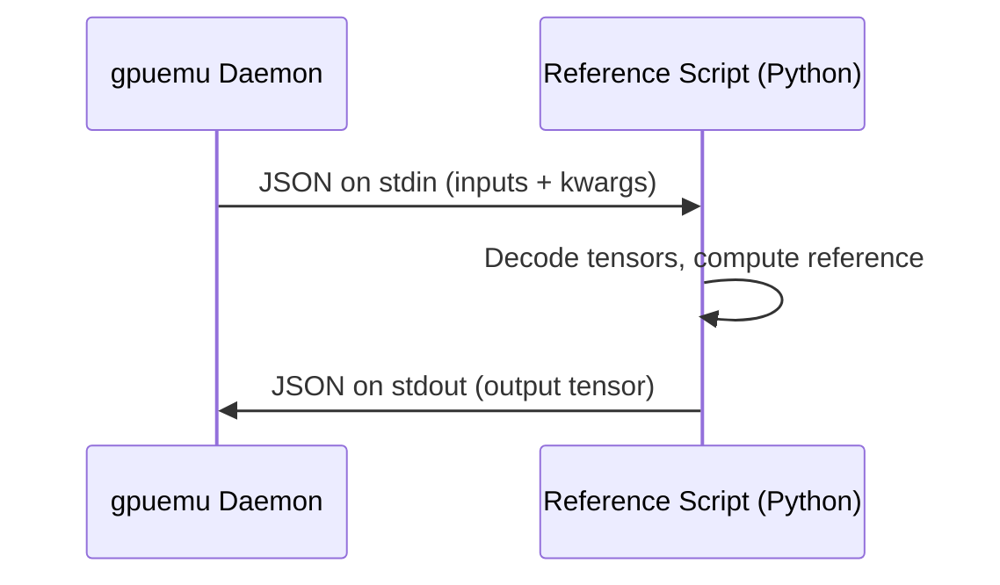

# Reference Scripts

Reference scripts are Python programs that provide canonical CPU implementations of ops and kernels. The gpuemu daemon executes them and compares their output against the op under test.

---

## Purpose

A reference script answers the question: _"Given these inputs, what is the correct output?"_

The daemon spawns the script as a child process, feeds it tensor inputs via a JSON+base64 protocol on stdin, and reads the expected output from stdout. The validation engine then compares this reference output against the output from the op under test.

!!! tip "Keep it simple"
    Reference scripts should be the simplest correct implementation of the op. Use pure NumPy whenever possible. The goal is correctness, not performance.

---

## Protocol

Reference scripts communicate with the daemon via a JSON-based stdin/stdout protocol. No network calls, no file I/O -- just standard streams.



### Input format (stdin)

The daemon writes a single JSON object to the script's stdin:

```json title="stdin"
{
  "inputs": {
    "a": {
      "shape": [4, 8],
      "strides": [8, 1],
      "dtype": "float32",
      "data": "AAAAAAAAAIA/AACAPwAAgD8AAIA/..."
    },
    "b": {
      "shape": [8, 16],
      "strides": [16, 1],
      "dtype": "float32",
      "data": "AAAAAAAAgD8AAIA/AACAPwAAgD8..."
    }
  },
  "kwargs": {
    "transpose": "false"
  }
}
```

Each tensor in `inputs` has four fields:

| Field | Type | Description |
|-------|------|-------------|
| `shape` | `list[int]` | Tensor dimensions, e.g. `[4, 8]` |
| `strides` | `list[int]` | Element strides (row-major by default), e.g. `[8, 1]` |
| `dtype` | `string` | Data type: `"float16"`, `"bfloat16"`, `"float32"`, `"float64"`, `"int32"`, `"int64"` |
| `data` | `string` | Raw tensor bytes, base64-encoded (standard encoding, not URL-safe) |

The `kwargs` dictionary contains string key-value pairs for op-specific parameters.

### Output format (stdout)

The script writes a single JSON object to stdout representing the output tensor:

```json title="stdout"
{
  "shape": [4, 16],
  "dtype": "float32",
  "data": "AAAAAAAAAIA/AACAPwAAgD8..."
}
```

| Field | Type | Description |
|-------|------|-------------|
| `shape` | `list[int]` | Output tensor dimensions |
| `dtype` | `string` | Output data type |
| `data` | `string` | Raw output bytes, base64-encoded |

!!! warning "No extra output"
    Do not print anything else to stdout. Logging, progress messages, and debug output must go to stderr. The daemon parses the entire stdout as a single JSON object.

---

## Supported DTypes

The protocol supports the following data types for tensor serialization:

| DType | NumPy equivalent | Byte size | Notes |
|-------|-----------------|:---------:|-------|
| `float16` | `np.float16` | 2 | IEEE 754 half-precision |
| `bfloat16` | N/A (use `np.float16` as proxy) | 2 | Brain floating point; NumPy lacks native support |
| `float32` | `np.float32` | 4 | IEEE 754 single-precision |
| `float64` | `np.float64` | 8 | IEEE 754 double-precision |
| `int32` | `np.int32` | 4 | 32-bit signed integer |
| `int64` | `np.int64` | 8 | 64-bit signed integer |

!!! note "bfloat16 handling"
    NumPy does not have a native `bfloat16` dtype. When the daemon sends `bfloat16` tensors, the Python client uses `np.float16` as a proxy for decoding. For accurate bfloat16 reference implementations, consider using PyTorch (`torch.bfloat16`) or ml_dtypes.

---

## Script Template

The `gpuemu init` command generates a reference script template. Here is the standard template:

```python title="scripts/ref_template.py"
#!/usr/bin/env python3
"""Reference implementation template for gpuemu validation."""

import sys
import json
import base64
import numpy as np


def decode_tensor(tensor_dict):
    """Decode a tensor from the gpuemu protocol.

    Args:
        tensor_dict: Dictionary with shape, dtype, and base64 data.

    Returns:
        numpy.ndarray with the decoded tensor data.
    """
    shape = tensor_dict["shape"]
    dtype = np.dtype(tensor_dict["dtype"])
    data = base64.b64decode(tensor_dict["data"])
    return np.frombuffer(data, dtype=dtype).reshape(shape)


def encode_tensor(arr):
    """Encode a numpy array for the gpuemu protocol.

    Args:
        arr: numpy.ndarray to encode.

    Returns:
        Dictionary with shape, dtype, and base64-encoded data.
    """
    return {
        "shape": list(arr.shape),
        "dtype": str(arr.dtype),
        "data": base64.b64encode(arr.tobytes()).decode("utf-8")
    }


def reference(**inputs):
    """Reference implementation.

    Args:
        **inputs: Named input tensors as numpy arrays.

    Returns:
        Output tensor as numpy array.
    """
    # TODO: Implement your reference logic here
    # Example:
    # return inputs["a"] + inputs["b"]
    raise NotImplementedError("Implement your reference logic")


def main():
    # Read input from stdin
    input_json = json.load(sys.stdin)

    # Decode input tensors
    inputs = {
        name: decode_tensor(tensor)
        for name, tensor in input_json["inputs"].items()
    }

    # Get kwargs
    kwargs = input_json.get("kwargs", {})

    # Run reference
    result = reference(**inputs, **kwargs)

    # Encode and output
    output = encode_tensor(result)
    json.dump(output, sys.stdout)


if __name__ == "__main__":
    main()
```

The template provides three key functions:

| Function | Purpose |
|----------|---------|
| `decode_tensor()` | Converts a protocol tensor dict (shape + dtype + base64 data) into a NumPy array |
| `encode_tensor()` | Converts a NumPy array into the protocol output format |
| `reference()` | The function you implement with your canonical op logic |

---

## Example: Matrix Multiplication

A complete reference script for a matrix multiplication op:

```python title="scripts/ref_matmul.py"
#!/usr/bin/env python3
"""Reference implementation for matmul validation.

This script is called by the gpuemu daemon to compute expected outputs.
Inputs are received via JSON+base64 on stdin, outputs are written via
JSON+base64 on stdout.
"""
import sys
import json
import base64
import numpy as np


def decode_tensor(tensor_dict):
    """Decode a tensor from the gpuemu protocol."""
    shape = tensor_dict["shape"]
    dtype = np.dtype(tensor_dict["dtype"])
    data = base64.b64decode(tensor_dict["data"])
    return np.frombuffer(data, dtype=dtype).reshape(shape).copy()


def encode_tensor(arr):
    """Encode a numpy array for gpuemu output."""
    arr = np.asarray(arr)
    return {
        "shape": list(arr.shape),
        "dtype": str(arr.dtype),
        "data": base64.b64encode(arr.tobytes()).decode("utf-8"),
    }


def reference(a, b, **kwargs):
    """Compute reference matrix multiplication.

    Args:
        a: Left matrix, shape (M, K).
        b: Right matrix, shape (K, N).
        **kwargs: Optional parameters.
            transpose: If "true", transpose b before multiplication.

    Returns:
        Result matrix, shape (M, N).
    """
    if kwargs.get("transpose") == "true":
        b = b.T

    # Use float64 accumulation for numerical stability
    result = np.matmul(
        a.astype(np.float64),
        b.astype(np.float64),
    )

    # Cast back to the input dtype
    return result.astype(a.dtype)


if __name__ == "__main__":
    input_json = json.load(sys.stdin)

    inputs = {
        name: decode_tensor(tensor)
        for name, tensor in input_json["inputs"].items()
    }

    kwargs = input_json.get("kwargs", {})

    result = reference(**inputs, **kwargs)
    json.dump(encode_tensor(result), sys.stdout)
```

And the corresponding configuration:

```toml title="gpuemu.toml"
[[ops]]
name = "my_matmul"
reference = "scripts/ref_matmul.py"
input_names = ["a", "b"]
execution_mode = "client_side"

[ops.tolerances]
float32 = 1e-4    # Matmul accumulates rounding error
float16 = 5e-3

[ops.invariants]
no_nan = true
no_inf = true
```

---

## Framework-Specific Templates

`gpuemu init` generates templates tailored to your framework. The key difference is how tensors are decoded (using framework-specific array types).

=== "PyTorch"

    ```python
    import torch

    def decode_tensor(tensor_dict):
        shape = tensor_dict["shape"]
        dtype = np.dtype(tensor_dict["dtype"])
        data = base64.b64decode(tensor_dict["data"])
        arr = np.frombuffer(data, dtype=dtype).reshape(shape).copy()
        return torch.from_numpy(arr)

    def encode_tensor(t):
        arr = t.detach().cpu().numpy() if isinstance(t, torch.Tensor) else np.asarray(t)
        return {
            "shape": list(arr.shape),
            "dtype": str(arr.dtype),
            "data": base64.b64encode(arr.tobytes()).decode("utf-8"),
        }

    def reference(x, **kwargs):
        return torch.relu(x)
    ```

=== "JAX"

    ```python
    import jax.numpy as jnp

    def decode_tensor(tensor_dict):
        shape = tensor_dict["shape"]
        dtype = np.dtype(tensor_dict["dtype"])
        data = base64.b64decode(tensor_dict["data"])
        return jnp.array(np.frombuffer(data, dtype=dtype).reshape(shape).copy())

    def encode_tensor(arr):
        np_arr = np.asarray(arr)
        return {
            "shape": list(np_arr.shape),
            "dtype": str(np_arr.dtype),
            "data": base64.b64encode(np_arr.tobytes()).decode("utf-8"),
        }

    def reference(x, **kwargs):
        return jnp.maximum(x, 0)
    ```

=== "TensorFlow"

    ```python
    import tensorflow as tf

    def decode_tensor(tensor_dict):
        shape = tensor_dict["shape"]
        dtype = np.dtype(tensor_dict["dtype"])
        data = base64.b64decode(tensor_dict["data"])
        return tf.constant(np.frombuffer(data, dtype=dtype).reshape(shape).copy())

    def encode_tensor(t):
        arr = t.numpy() if isinstance(t, tf.Tensor) else np.asarray(t)
        return {
            "shape": list(arr.shape),
            "dtype": str(arr.dtype),
            "data": base64.b64encode(arr.tobytes()).decode("utf-8"),
        }

    def reference(x, **kwargs):
        return tf.nn.relu(x)
    ```

---

## Tips for Writing Reference Scripts

### Keep it pure NumPy

Reference scripts should be simple and correct. Avoid importing your GPU kernel code or using framework-specific optimizations. If the reference is wrong, every validation result is meaningless.

```python
# Good: simple, readable, obviously correct
def reference(x, **kwargs):
    return np.maximum(x, 0)

# Bad: importing the thing you are testing
def reference(x, **kwargs):
    from my_gpu_lib import optimized_relu
    return optimized_relu(x)
```

### Handle edge cases

Test your reference script with edge-case inputs before using it in validation:

- **Empty tensors**: Shape like `(0,)` or `(0, 128)`. Ensure the script does not crash.
- **Scalar tensors**: Shape `()` or `(1,)`.
- **Very large values**: Near `float32` max (~3.4e38). Watch for overflow in exp, log, etc.
- **Very small values**: Near zero or subnormal. Watch for division by zero.

```python
def reference(x, **kwargs):
    # Handle empty tensor
    if x.size == 0:
        return np.empty_like(x)

    # Numerically stable softmax
    shifted = x - np.max(x, axis=-1, keepdims=True)
    exp_x = np.exp(shifted)
    return exp_x / np.sum(exp_x, axis=-1, keepdims=True)
```

### Use higher-precision accumulation

For reductions (matmul, sum, mean), accumulate in `float64` to reduce reference-side rounding error:

```python
def reference(a, b, **kwargs):
    # Accumulate in float64, then cast back
    result = np.matmul(a.astype(np.float64), b.astype(np.float64))
    return result.astype(a.dtype)
```

### Test scripts independently

You can test a reference script without the daemon by piping JSON to it:

```bash
echo '{"inputs":{"x":{"shape":[2,3],"strides":[3,1],"dtype":"float32","data":"AACAPwAAAAAAAAAAAACAPwAAgD8AAIA/"}},"kwargs":{}}' \
  | python scripts/ref_relu.py
```

Expected output:

```json
{"shape": [2, 3], "dtype": "float32", "data": "AACAPwAAAAAAAAAAAACAPwAAgD8AAIA/"}
```

### Send debug output to stderr

If you need logging or debug output, write it to stderr so it does not interfere with the JSON protocol:

```python
import sys

def reference(x, **kwargs):
    print(f"Input shape: {x.shape}, dtype: {x.dtype}", file=sys.stderr)
    result = np.maximum(x, 0)
    print(f"Output range: [{result.min()}, {result.max()}]", file=sys.stderr)
    return result
```

### Respect the `.copy()` call

When decoding tensors with `np.frombuffer`, the resulting array shares memory with the buffer and is read-only. Always call `.copy()` if the reference implementation modifies the array in place:

```python
def decode_tensor(tensor_dict):
    shape = tensor_dict["shape"]
    dtype = np.dtype(tensor_dict["dtype"])
    data = base64.b64decode(tensor_dict["data"])
    # .copy() ensures the array is writable
    return np.frombuffer(data, dtype=dtype).reshape(shape).copy()
```
