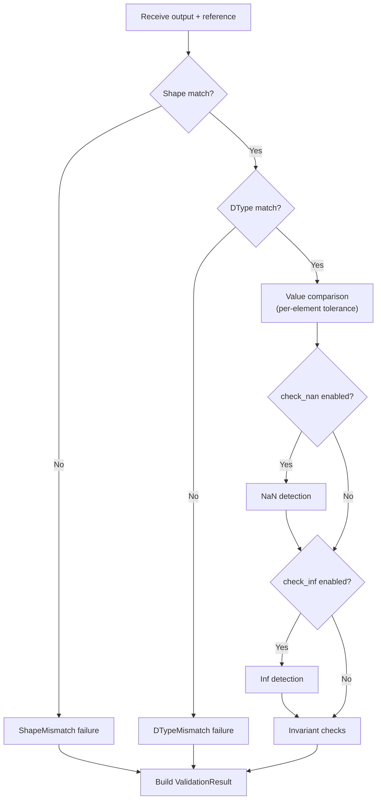

# Validation

gpuemu's validation engine compares the output of an op under test against a reference implementation. This page describes the validation pipeline, tolerance system, failure types, invariant checks, and tolerance calibration.

!!! tip "Why this differs from `torch.allclose`"

    The field-standard correctness oracle (`torch.allclose` on one shape, one dtype, one
    seed) is blind to entire bug classes. gpuemu's validation pipeline below is the
    direct answer to that gap. See [The Problem](../why-gpuemu/the-problem.md) for the
    measured walkthrough.

---

## Validation Pipeline

Validation proceeds through an ordered sequence of checks. If an early check fails (shape or dtype mismatch), subsequent value-level checks are skipped.



### Step-by-step

1. **Shape check** -- The output shape must exactly match the reference shape. A mismatch produces a `ShapeMismatch` failure and skips all remaining checks.
2. **DType check** -- The output dtype must exactly match the reference dtype. A mismatch produces a `DTypeMismatch` failure and skips remaining checks.
3. **Value comparison** -- Each element is compared using the absolute tolerance for the tensor's dtype: `|output[i] - reference[i]| <= tolerance`. Both the max absolute diff and max relative diff are tracked across all elements. The first element that exceeds tolerance is reported.
4. **NaN check** -- If `check_nan` is enabled (default: true), the output is scanned for NaN values. The first occurrence is reported as a `NaNDetected` failure.
5. **Inf check** -- If `check_inf` is enabled (default: true), the output is scanned for Inf values. The first occurrence is reported as an `InfDetected` failure.
6. **Invariant checks** -- Op-specific invariants are enforced (non-negative, shape preserved, etc.). See [Invariant Checks](#invariant-checks) below.

---

## Tolerance System

Tolerances define the maximum allowed absolute difference between the op output and the reference output, on a per-element basis. The comparison formula is:

$$
|output_i - reference_i| \leq tolerance
$$

### Default tolerances by dtype

| DType | Default Tolerance | Rationale |
|-------|:-----------------:|-----------|
| `float32` | `1e-5` | Standard single-precision epsilon-scale tolerance |
| `float16` | `1e-3` | Half-precision has ~3 decimal digits of precision |
| `bfloat16` | `1e-3` | Brain float has similar precision to float16 |
| `float64` | `1e-5` | Conservative tolerance for double-precision |
| Integer types | `0` (exact) | Integer ops must produce exact matches |

!!! info "Default tolerance fallback"
    If a dtype is not listed in the tolerance map, the validator falls back to `1e-5`.

### Overriding tolerances

Tolerances can be set at three levels, with more specific settings taking precedence:

=== "Global (gpuemu.toml)"

    ```toml
    [validation.tolerances]
    float32 = 1e-5
    float16 = 1e-3
    bfloat16 = 1e-3
    float64 = 1e-10
    ```

=== "Per-Op"

    ```toml
    [[ops]]
    name = "my_matmul"
    reference = "scripts/ref_matmul.py"

    [ops.tolerances]
    float32 = 1e-4    # Matmul accumulates more error
    float16 = 5e-3
    ```

=== "Per-Kernel"

    ```toml
    [[kernels]]
    name = "flash_attn_kernel"
    reference = "scripts/ref_flash_attn.py"

    [kernels.tolerances]
    float32 = 1e-4
    float16 = 1e-2    # Attention is numerically sensitive
    ```

---

## Max Diff Tracking

Every validation run tracks two summary statistics across all elements:

| Metric | Definition | Purpose |
|--------|-----------|---------|
| **Max absolute diff** | `max(|output[i] - reference[i]|)` for all `i` | Identifies the worst-case absolute error |
| **Max relative diff** | `max(|output[i] - reference[i]| / |reference[i]|)` for all `i` | Identifies the worst-case relative error; uses absolute diff as fallback when reference is zero |

These metrics are stored in the `ValidationResult` and are available for baseline comparison and regression detection.

```python
result = client.validate_op("my_op", inputs, output)
print(f"Max absolute diff: {result.max_diff:.2e}")
print(f"Max relative diff: {result.max_rel_diff:.2e}")
```

---

## NaN and Inf Detection

NaN and Inf detection are independent checks that run after the value comparison.

| Setting | Config key | Default | Behavior |
|---------|-----------|:-------:|----------|
| **NaN detection** | `check_nan` | `true` | Scans output for NaN values; reports first occurrence |
| **Inf detection** | `check_inf` | `true` | Scans output for Inf values; reports first occurrence |

```toml title="gpuemu.toml"
[validation]
check_nan = true
check_inf = true
```

!!! warning "First occurrence only"
    For performance, NaN and Inf detection reports only the **first** occurrence. If you need to find all occurrences, inspect the raw output tensor after a failure.

Detection applies to floating-point types (`float16`, `bfloat16`, `float32`, `float64`). Integer and boolean types are not scanned.

---

## Invariant Checks

Invariants are op-specific properties that the output must satisfy, independent of the reference comparison. They are configured per-op or per-kernel.

| Invariant | Config key | Description |
|-----------|-----------|-------------|
| **Non-negative** | `non_negative` | Every element in the output must be >= 0. Reports the first negative value. |
| **Shape preserved** | `shape_preserved` | The output shape must match the primary input shape. Useful for element-wise ops. |
| **No NaN** | `no_nan` | Equivalent to the global `check_nan`, but configured per-op. |
| **No Inf** | `no_inf` | Equivalent to the global `check_inf`, but configured per-op. |

### Configuration example

```toml title="gpuemu.toml"
[[ops]]
name = "my_relu"
reference = "scripts/ref_relu.py"
input_names = ["x"]

[ops.invariants]
non_negative = true       # ReLU output must be >= 0
shape_preserved = true    # Output shape must match input shape
no_nan = true
no_inf = true
```

---

## Five Categories of Validation

gpuemu's validation covers five complementary categories:

### 1. Correctness checks

The core value comparison: does the op produce the same output (within tolerance) as the reference implementation? This catches logic bugs, indexing errors, and incorrect algorithm implementations.

### 2. Numerical stability

NaN and Inf detection, tolerance tracking, and max diff reporting. These identify numerical issues like overflow, underflow, division by zero, and loss of precision in reductions.

### 3. Invariants

Property-based checks that enforce domain-specific constraints (non-negativity for activation functions, shape preservation for element-wise ops). These catch a class of bugs that value comparison alone might miss.

### 4. Artifact-based checks

PTX/SASS inspection for register pressure, spills, local memory usage, and forbidden instruction patterns. These catch performance-affecting issues in the compiled kernel, not correctness issues in the logic.

### 5. Fuzzing strategy

Seeded random testing across shapes, dtypes, and memory layouts. The fuzzer systematically explores edge cases (batch size 1, empty tensors, transposed layouts) that manual tests often miss. Seeds enable deterministic reproduction of failures.

---

## Failure Types

Each validation failure carries a `FailureKind` that identifies the category of problem.

| Failure Kind | Description | Includes index? | Includes expected/actual? |
|-------------|-------------|:---------------:|:-------------------------:|
| `ToleranceExceeded` | Element-wise difference exceeds the configured tolerance | Yes | Yes |
| `NaNDetected` | NaN found in the output tensor | Yes | No |
| `InfDetected` | Inf found in the output tensor | Yes | No |
| `ShapeMismatch` | Output shape does not match reference shape | No | No |
| `DTypeMismatch` | Output dtype does not match reference dtype | No | No |
| `InvariantViolation` | An invariant check failed (non-negative, shape preserved, etc.) | Sometimes | Sometimes |
| `ReferenceError` | The reference script failed to execute (non-zero exit, timeout) | No | No |

### Failure structure

Each failure includes:

```json
{
  "kind": "ToleranceExceeded",
  "message": "Tolerance exceeded at index 42: diff=1.23e-03 > tol=1.00e-05",
  "index": 42,
  "expected": 0.5,
  "actual": 0.50123
}
```

- **`kind`** -- The failure type enum.
- **`message`** -- A human-readable description with specifics.
- **`index`** -- The flattened tensor index where the failure occurred (if applicable).
- **`expected`** -- The reference value at that index (if applicable).
- **`actual`** -- The output value at that index (if applicable).

---

## Tolerance Calibration

The Python client provides utilities for empirically determining appropriate tolerances.

### `calibrate_tolerance()`

Runs both implementations on random inputs and measures the actual differences to determine safe tolerances:

```python title="calibration_example.py"
from gpuemu.tolerances import calibrate_tolerance

def reference_softmax(x):
    e_x = np.exp(x - np.max(x, axis=-1, keepdims=True))
    return e_x / e_x.sum(axis=-1, keepdims=True)

def my_softmax(x):
    # Your optimized implementation
    return custom_softmax_kernel(x)

tol = calibrate_tolerance(
    reference_fn=reference_softmax,
    test_fn=my_softmax,
    input_shapes=[(32, 128), (64, 256), (128, 512)],
    dtype="float32",
    n_samples=100,
    seed=42,
    percentile=99.0,      # Use 99th percentile of observed diffs
    safety_margin=2.0,     # Multiply by 2x for safety
)

print(f"Recommended: atol={tol.atol:.2e}, rtol={tol.rtol:.2e}")
```

### `get_recommended_tolerance()`

Returns pre-calibrated tolerances with operation-specific multipliers:

```python title="recommended_tolerance.py"
from gpuemu.tolerances import get_recommended_tolerance

# Basic usage
tol = get_recommended_tolerance("float32")

# With framework adjustment
tol = get_recommended_tolerance("float16", framework="jax")

# With operation-specific multiplier
tol = get_recommended_tolerance("float32", framework="pytorch", operation="matmul")
```

### Operation-specific multipliers

Certain operations accumulate more numerical error than element-wise ops. `get_recommended_tolerance()` applies these multipliers to the base tolerance:

| Operation | Multiplier | Rationale |
|-----------|:----------:|-----------|
| `matmul` | 1.5x | Matrix multiply accumulates rounding errors across the reduction dimension |
| `softmax` | 1.5x | Exponentiation amplifies small differences |
| `conv2d` | 2.0x | Convolution involves many fused multiply-adds |
| `batchnorm` | 2.0x | Normalization is sensitive to variance computation |
| `layernorm` | 2.0x | Same sensitivity as batchnorm |
| `attention` | 2.5x | Combines multiple softmax and matmul operations |

### Tolerance profiles

For convenience, the Python client provides pre-configured tolerance profiles:

```python title="tolerance_profiles.py"
from gpuemu.tolerances import ToleranceProfile

# For unit testing (moderately strict)
testing = ToleranceProfile.for_testing()
tol = testing.get("float32")  # atol=1e-5, rtol=1e-4

# For production validation (strict)
production = ToleranceProfile.for_production()
tol = production.get("float32")  # atol=1e-6, rtol=1e-5

# For cross-framework comparison (relaxed)
cross = ToleranceProfile.for_cross_framework("pytorch", "jax")
tol = cross.get("float32")  # Automatically scaled for framework differences
```

---

## Putting It Together

A complete validation workflow combining tolerance calibration, custom invariants, and failure handling:

```python title="complete_validation.py"
from gpuemu import Client
from gpuemu.tolerances import get_recommended_tolerance
import numpy as np

client = Client()

# Get recommended tolerance for this op + dtype combination
tol = get_recommended_tolerance("float32", operation="matmul")
print(f"Using tolerance: atol={tol.atol:.2e}")

# Run validation
a = np.random.randn(32, 64).astype(np.float32)
b = np.random.randn(64, 128).astype(np.float32)
output = a @ b  # Your GPU matmul

result = client.validate_op("my_matmul", {"a": a, "b": b}, output)

if result.passed:
    print(f"PASSED (max_diff={result.max_diff:.2e})")
else:
    print(f"FAILED with {len(result.failures)} failures:")
    for failure in result.failures:
        print(f"  [{failure['kind']}] {failure['message']}")

    # Reproduce the failure
    if result.seed:
        repro = client.reproduce(result.seed)
        print(f"Reproduced with inputs: {list(repro.inputs.keys())}")
```
