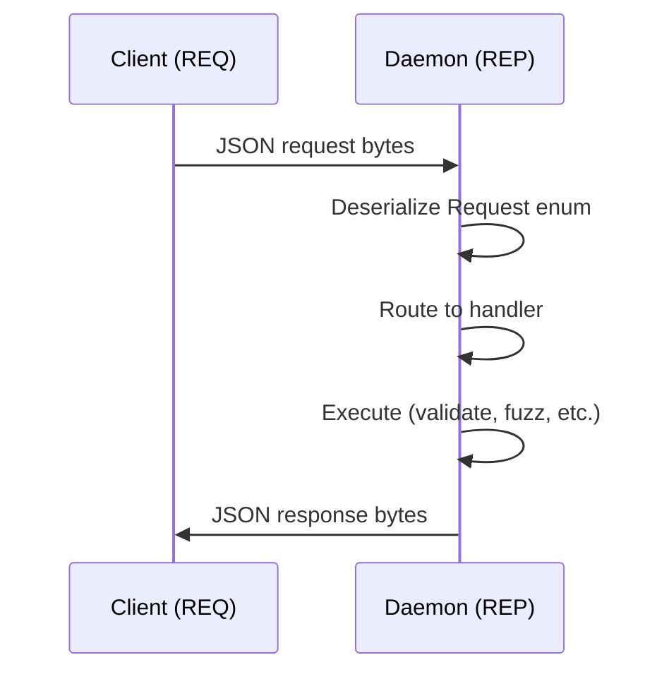
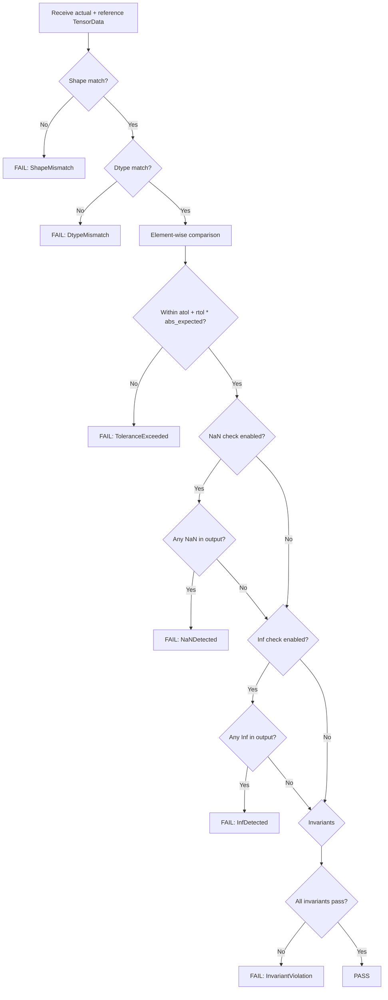

# Architecture Internals

A deep dive into the gpuemu codebase for contributors. This page covers the internal structure of every component, the IPC protocol implementation, the validation pipeline, and the design decisions behind each subsystem.

---

## Crate Structure

gpuemu is a Rust workspace with three crates, each with a distinct responsibility.

### `gpuemu-common`

Shared library crate used by both the daemon and CLI. Contains no binaries.

```
crates/gpuemu-common/src/
├── lib.rs          # Crate root, re-exports
├── types.rs        # Core data types: TensorData, ValidationResult, FailureReason, etc.
├── protocol.rs     # IPC message definitions: Request, Response, error codes
├── config.rs       # GpuemuConfig, OpConfig, KernelConfig, ToleranceConfig parsing
└── rng.rs          # Xorshift128+ RNG with Blake2b seed derivation
```

| File | Responsibility |
|------|----------------|
| `types.rs` | Defines `TensorData` (shape, strides, dtype, raw bytes), `ValidationResult`, `FailureReason`, `FuzzConfig`, `ArtifactMetrics`, and all other shared types. Uses `serde` for JSON serialization and `rkyv` for zero-copy storage. |
| `protocol.rs` | Defines the `Request` and `Response` enums that constitute the IPC wire protocol. Includes `PROTOCOL_VERSION` constant and all error code variants. |
| `config.rs` | Parses `gpuemu.toml` into `GpuemuConfig`. Handles merging of project, user, and daemon config files. Validates field values and provides defaults. |
| `rng.rs` | Implements xorshift128+ PRNG with a `Blake2b`-based seed derivation function. The same algorithm is implemented in Python (`gpuemu_py/rng.py`) for cross-language reproducibility. Given the same seed, both implementations produce bit-identical sequences. |

### `gpuemu-daemon`

The daemon binary crate. Contains the server, validation engine, and all background processing logic.

```
crates/gpuemu-daemon/src/
├── main.rs         # Daemon entry point, CLI args, tokio runtime setup
├── server.rs       # NNG REP socket listener, request routing, response dispatch
├── validator.rs    # Validation engine: shape/dtype/value/NaN/Inf/invariant checks
├── executor.rs     # Reference script subprocess management
├── fuzzer.rs       # Fuzz test case generation and orchestration
├── artifact.rs     # PTX/SASS parsing, artifact linting, baseline diffing
└── storage.rs      # sled database interface for results, failures, baselines, artifacts
```

| File | Responsibility |
|------|----------------|
| `server.rs` | Binds the NNG REP socket at the configured path (default `~/.gpuemu/gpuemu.sock`). Runs an async event loop via Tokio that accepts requests, deserializes them, routes to the appropriate handler, and sends back serialized responses. Handles `Ping`, `Shutdown`, and all other request types. |
| `validator.rs` | The core validation engine. Accepts a `TensorData` (actual output) and a `TensorData` (reference output) and runs an ordered check pipeline: (1) shape match, (2) dtype match, (3) element-wise value comparison with per-dtype `atol`/`rtol`, (4) NaN detection, (5) Inf detection, (6) invariant enforcement. Returns a `ValidationResult` with pass/fail status, max absolute diff, max relative diff, and a list of `FailureReason` values. |
| `executor.rs` | Manages Python reference script execution. Spawns scripts as child processes via `std::process::Command`, writes JSON+base64 input to stdin, reads JSON+base64 output from stdout. Implements a configurable timeout (default 60 seconds). Captures stderr for error reporting. |
| `fuzzer.rs` | Generates randomized test cases from a `FuzzConfig`. Varies shapes (within configured min/max bounds), dtypes, memory layouts, and value distributions. Uses the xorshift128+ RNG from `gpuemu-common` for deterministic seed-based generation. Orchestrates batch execution via the executor and validator. Supports test case minimization via binary search on dimensions. |
| `artifact.rs` | Contains `PtxParser` and `SassParser` for extracting metrics from compiled GPU artifacts. `PtxParser` uses regex-based extraction to find register counts, spill counts, shared memory usage, local memory usage, and instruction counts from PTX text. `SassParser` (optional) invokes `cuobjdump` as a subprocess for SASS-level analysis. `ArtifactLinter` checks extracted metrics against policy thresholds. `ArtifactDiffer` compares current metrics against a stored baseline and flags regressions. |
| `storage.rs` | Wraps the sled embedded database. Provides typed get/put/list operations for validation results, failures, baselines, and artifact metrics. Uses `rkyv` for zero-copy serialization of stored values, making reads fast without deserialization overhead. Handles database creation, compaction, and error recovery. |

### `gpuemu-cli`

The CLI binary crate. Produces the user-facing `gpuemu` command.

```
crates/gpuemu-cli/src/
├── main.rs         # Entry point, clap argument parsing, subcommand dispatch
├── report.rs       # Output formatting: text, JSON, JUnit XML
├── debug/
│   ├── mod.rs      # Debug subcommand module
│   └── repl.rs     # Interactive debug REPL for inspecting validation state
└── init/
    ├── mod.rs      # Init subcommand module
    └── templates.rs # Scaffolding templates for gpuemu.toml and reference scripts
```

| File | Responsibility |
|------|----------------|
| `main.rs` | Defines the CLI structure using `clap`. Subcommands include `daemon` (start/stop/status/logs), `test`, `fuzz`, `reproduce`, `minimize`, `failures`, `baseline`, `lint`, `ci`, `init`, `debug`, `version`, and `status`. Each subcommand connects to the daemon via NNG REQ socket and sends the appropriate request. |
| `report.rs` | Formats validation results for output. Supports three modes: `text` (human-readable with colored pass/fail indicators), `json` (structured JSON for scripting), and `junit` (JUnit XML for CI platform integration). |
| `debug/repl.rs` | An interactive REPL for debugging validation issues. Allows inspecting stored results, replaying seeds, examining tensor values, and stepping through the validation pipeline. Useful for understanding why a specific test case fails. |
| `init/templates.rs` | Contains template strings for `gpuemu init` scaffolding. Generates a starter `gpuemu.toml` and example reference script based on the selected framework. |

---

## IPC Layer

All communication between clients (CLI, Python, VS Code) and the daemon uses NNG (nanomsg-next-gen) sockets with JSON serialization.

### Transport

| Property | Value |
|----------|-------|
| **Socket type** | REP/REQ (synchronous request-response) |
| **Transport** | Unix domain socket via NNG IPC (`ipc://` scheme) |
| **Default path** | `~/.gpuemu/gpuemu.sock` |
| **Serialization** | JSON (`serde_json` in Rust, `json` in Python) |
| **Protocol version** | 1 (`PROTOCOL_VERSION` in `protocol.rs`) |

### Request-Response Flow



The protocol is strictly synchronous: one request produces one response. The NNG REP/REQ pattern enforces this at the socket level. Concurrent clients are serialized by the daemon's event loop.

### Message Definitions

All messages are defined as Rust enums in `protocol.rs` and serialized as JSON with a `type` discriminator field:

```rust
// Simplified from protocol.rs
#[derive(Serialize, Deserialize)]
#[serde(tag = "type")]
pub enum Request {
    Ping,
    Shutdown,
    ValidateOp { op_name: String, inputs: HashMap<String, TensorData>, output: TensorData, kwargs: Value },
    FuzzOp { op_name: String, config: FuzzConfig },
    Reproduce { op_name: String, seed: u64 },
    Minimize { op_name: String, seed: u64 },
    // ... additional variants
}

#[derive(Serialize, Deserialize)]
#[serde(tag = "type")]
pub enum Response {
    Pong { version: String, protocol_version: u32, uptime_seconds: u64 },
    Ok,
    ValidationResult { result: ValidationResult },
    Error { code: String, message: String },
    // ... additional variants
}
```

### Version Negotiation

Clients send a `Ping` request on first connection. The daemon responds with `Pong` containing the protocol version. If the versions do not match, the client raises a `ClientError` with instructions to upgrade.

---

## Storage

### sled Database

gpuemu uses [sled](https://github.com/spacejam/sled), an embedded key-value database written in Rust. The database lives at `~/.gpuemu/db/` and is opened when the daemon starts.

```
~/.gpuemu/db/
├── conf                # sled configuration
├── blobs/              # Large value storage
└── db                  # Main B-tree
```

### Data Organization

Data is organized into logical trees (namespaces) within the sled database:

| Tree | Key | Value | Purpose |
|------|-----|-------|---------|
| `results` | `{op_name}:{seed}` | `ValidationResult` (rkyv) | Stores every validation result |
| `failures` | `{op_name}:{seed}:{timestamp}` | `ValidationResult` (rkyv) | Index of failed validations for quick lookup |
| `baselines` | `{tag}:{op_name}` | `ValidationResult` (rkyv) | Named baseline snapshots for regression detection |
| `artifacts` | `{kernel_name}:{timestamp}` | `ArtifactMetrics` (rkyv) | PTX/SASS metrics for each kernel |
| `artifact_baselines` | `{tag}:{kernel_name}` | `ArtifactMetrics` (rkyv) | Named artifact baselines for regression detection |

### Serialization

Values stored in sled use [rkyv](https://github.com/rkyv/rkyv) for zero-copy deserialization. This means reading a stored `ValidationResult` does not require parsing or allocation -- the bytes in the database are directly interpretable as a Rust struct. This makes bulk operations (listing results, scanning failures) fast.

The IPC wire protocol uses JSON (via `serde_json`) because it needs to be readable by Python and TypeScript clients. The storage layer uses rkyv because it only needs to be readable by Rust.

---

## Validation Pipeline

The validation engine in `validator.rs` runs a fixed sequence of checks. Each check can produce a `FailureReason` that is collected into the final `ValidationResult`.



### Executor Detail

The `Executor` in `executor.rs` manages the reference script subprocess lifecycle:

1. **Serialize inputs**: Convert `HashMap<String, TensorData>` to JSON with base64-encoded tensor bytes.
2. **Spawn process**: `std::process::Command::new("python3").arg(script_path).stdin(Stdio::piped()).stdout(Stdio::piped()).stderr(Stdio::piped())`
3. **Write stdin**: Pipe the JSON input to the child process stdin.
4. **Read stdout**: Read the child's stdout, parse as JSON, decode base64 tensor data back into `TensorData`.
5. **Timeout**: If the child does not exit within the configured timeout, kill it and return `ReferenceScriptFailed`.
6. **Error handling**: If the exit code is non-zero, return `ReferenceScriptFailed` with the captured stderr.

---

## Fuzzer

The fuzzer in `fuzzer.rs` generates test cases by systematically varying input parameters.

### FuzzConfig

The `FuzzConfig` struct controls what the fuzzer varies:

```rust
pub struct FuzzConfig {
    pub iterations: usize,          // Number of test cases to generate
    pub min_shape: Vec<usize>,      // Minimum dimensions (e.g., [1, 1])
    pub max_shape: Vec<usize>,      // Maximum dimensions (e.g., [256, 512])
    pub dtypes: Vec<String>,        // Dtypes to test
    pub layouts: Vec<Layout>,       // Memory layouts: Contiguous, Strided, Transposed
    pub seed: Option<u64>,          // Base seed (None = random)
}
```

### RNG and Reproducibility

The fuzzer uses **xorshift128+** as its core PRNG, seeded via **Blake2b** hash derivation. This design enables two critical properties:

1. **Deterministic**: Given the same seed, the fuzzer produces identical test cases on every run.
2. **Cross-language**: The same algorithm is implemented in both Rust (`gpuemu-common/src/rng.rs`) and Python (`gpuemu_py/rng.py`), producing bit-identical sequences. This means a failure seed from the CLI can be reproduced in Python, and vice versa.

The seed derivation chain:

```
base_seed (u64)
  -> Blake2b(base_seed || iteration_index)
  -> 128-bit state
  -> xorshift128+ stream
  -> shape values, dtype selection, tensor element values
```

### Test Case Minimization

When a failure is found, the minimizer (`minimize` function in `fuzzer.rs`) searches for the smallest input that still triggers the same failure. It uses binary search on:

1. **Dimensions**: Halve each dimension independently until the failure disappears, then back off.
2. **Values**: Narrow the value range to isolate problematic magnitudes.

The result is a minimal reproducer that is easier to debug and suitable as a regression test.

---

## Artifact Inspector

The artifact subsystem in `artifact.rs` analyzes compiled GPU code without executing it.

### PtxParser

Extracts metrics from PTX assembly text using regex patterns:

| Metric | Regex Pattern | Example Match |
|--------|---------------|---------------|
| Register count | `.reg .b32 %r<N>` | `.reg .b32 %r<64>` -> 64 registers |
| Spill stores | `st.local` instructions | Count of `st.local` occurrences |
| Spill loads | `ld.local` instructions | Count of `ld.local` occurrences |
| Shared memory | `.shared .align N .bM name[SIZE]` | Shared memory allocation size |
| Local memory | `.local .align N .bM name[SIZE]` | Local memory allocation size |
| Instruction count | All non-directive, non-label lines | Total instruction count |

### SassParser (Optional)

Invokes `cuobjdump --dump-sass` as a subprocess to extract SASS-level metrics. Only available on Linux systems with the CUDA toolkit installed. Falls back gracefully when `cuobjdump` is not found.

### ArtifactLinter

Checks extracted metrics against policy thresholds defined in `[[kernels]]` configuration:

```toml
[kernels.artifact_checks]
max_registers = 64
max_spills = 0
max_local_memory_bytes = 0
forbidden_instructions = ["LDG.E.SYS"]
```

Produces warnings or failures when thresholds are exceeded.

### ArtifactDiffer

Compares current artifact metrics against a named baseline. Reports regressions (metrics that increased) and improvements (metrics that decreased). Used in CI to detect performance regressions in compiled kernel code.

---

## Python Package Structure

The Python client (`gpuemu-py`) provides programmatic access to the daemon and framework-specific adapters.

```
gpuemu_py/
├── __init__.py         # Package exports
├── client.py           # GpuemuClient: NNG REQ socket, send/receive, protocol handling
├── validate.py         # validate_op(), test case generation, result parsing
├── rng.py              # Xorshift128+ and Blake2b seed derivation (mirrors Rust impl)
├── tolerances.py       # get_recommended_tolerance(), calibrate_tolerance()
└── frameworks/
    ├── __init__.py
    ├── base.py          # BaseAdapter: abstract interface for framework adapters
    ├── pytorch.py       # PyTorchAdapter: torch.Tensor <-> TensorData conversion
    ├── jax.py           # JaxAdapter: jax.Array <-> TensorData conversion
    └── tensorflow.py    # TensorFlowAdapter: tf.Tensor <-> TensorData conversion
```

| Module | Responsibility |
|--------|----------------|
| `client.py` | Manages the NNG REQ socket connection to the daemon. Handles connection, disconnection, request serialization, response deserialization, protocol version checking, and error mapping to Python exceptions (`ClientError`, `ValidationError`, `ConnectionError`). |
| `validate.py` | High-level validation API. `validate_op()` accepts an op name, input tensors, and the computed output, sends a `ValidateOp` request to the daemon, and returns a structured `ValidationResult`. Also provides `fuzz_op()` and `reproduce()` wrappers. |
| `rng.py` | Pure-Python implementation of the same xorshift128+ PRNG and Blake2b seed derivation used in Rust. Ensures that seeds are portable across languages -- a seed from a Rust fuzz run can be used in Python to generate identical inputs. |
| `tolerances.py` | Tolerance utilities. `get_recommended_tolerance(op, dtype)` returns empirically-tuned defaults. `calibrate_tolerance(client, op, dtype, iterations)` runs multiple validation passes and computes the minimum tolerance that passes all iterations, with a configurable safety margin. |
| `frameworks/base.py` | Defines `BaseAdapter` with abstract methods `to_tensor_data()` and `from_tensor_data()`. All framework adapters inherit from this. |
| `frameworks/pytorch.py` | Converts `torch.Tensor` to/from the `TensorData` dict format. Handles device transfer (GPU -> CPU), dtype mapping, stride extraction, and the `validate_pytorch()` context manager. |
| `frameworks/jax.py` | Converts `jax.Array` to/from `TensorData`. Handles JAX's functional tensor model and the `validate_jax()` context manager. |
| `frameworks/tensorflow.py` | Converts `tf.Tensor` to/from `TensorData`. Handles eager/graph mode differences and the `validate_tensorflow()` context manager. |

---

## VS Code Extension

The VS Code extension (`vscode-gpuemu`) provides editor integration by invoking the `gpuemu` CLI as a child process and mapping results to VS Code APIs.

```
vscode-gpuemu/src/
├── extension.ts                 # Extension activation, registration of providers and commands
├── runner.ts                    # Spawns gpuemu CLI commands, parses JSON output
├── providers/
│   ├── diagnostics.ts           # DiagnosticManager: maps validation failures to Problems panel
│   ├── codeActions.ts           # Quick fixes: "Reproduce this failure", "Minimize", "Adjust tolerance"
│   ├── configValidator.ts       # Validates gpuemu.toml and reports config errors
│   ├── failuresTree.ts          # Tree view provider for the Failures sidebar
│   ├── statusBar.ts             # Status bar item showing daemon status and last run result
│   ├── testController.ts        # TestController: integrates with VS Code Testing sidebar
│   └── validationWatcher.ts     # FileSystemWatcher: triggers validation on file save
└── commands/
    └── index.ts                 # Command palette commands (start daemon, run tests, fuzz, etc.)
```

### Pseudo-LSP Architecture

The extension does not implement a full Language Server Protocol server. Instead, it uses a "pseudo-LSP" pattern:

1. **`runner.ts`** spawns `gpuemu` CLI commands with `--format json` and parses the structured output.
2. **Providers** consume the parsed results and push them to VS Code APIs (diagnostics, test items, tree views).
3. **Watchers** trigger re-validation when relevant files change.

This design avoids maintaining a separate language server process while still providing rich editor integration.

### Key Providers

**`DiagnosticManager`** (`diagnostics.ts`): Maps validation failures to VS Code `Diagnostic` objects in the Problems panel. Each failure becomes a diagnostic with severity (Error for failures, Warning for tolerance warnings), a message describing the failure reason, and a source location pointing to the op definition in `gpuemu.toml` or the source file.

**`TestController`** (`testController.ts`): Integrates with VS Code's built-in Testing sidebar. Each op becomes a test item with child items for each dtype. Running tests invokes `gpuemu test --format json` and maps results to pass/fail/skip states.

**`ValidationWatcher`** (`validationWatcher.ts`): Watches for saves to reference scripts and op source files. When a watched file is saved, it triggers re-validation for the affected ops and updates diagnostics. Debounces rapid saves to avoid excessive daemon calls.

---

## Next Steps

- [Contributing](contributing.md) -- How to set up a development environment and submit changes.
- [Architecture Overview](../concepts/architecture.md) -- Higher-level architecture for users (not just contributors).
- [IPC Protocol Reference](../reference/protocol.md) -- Full protocol specification.
- [Configuration](../getting-started/configuration.md) -- Config file format and all available options.
