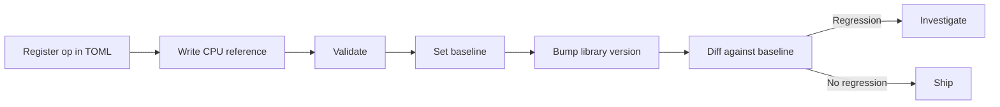

# Custom Op Integrator Guide

A guide for engineers who integrate third-party CUDA kernels -- FlashAttention, xFormers, Triton kernels, cuDNN custom ops -- and need to validate that they produce correct results.

---

## Who This Is For

!!! info "Target audience"

    You are an **op integrator** who:

    - Uses pre-built CUDA kernels from libraries like FlashAttention, xFormers, Triton, or custom CUDA extensions
    - Did not write the kernel source yourself, but need to verify it produces correct outputs
    - Wants to detect regressions when upgrading library versions (e.g., FlashAttention 2.3 to 2.4)
    - Needs to validate correctness across different shapes, dtypes, and memory layouts

    If you write your own training code and custom ops, see the [Model Developer Guide](model-developer.md). If you write CUDA kernels directly, see the [Kernel Author Guide](kernel-author.md).

---

## Workflow Overview

The integrator workflow is:



1. **Register** the op in `gpuemu.toml`
2. **Write** a NumPy reference implementation
3. **Validate** that the third-party kernel matches the reference
4. **Set a baseline** to snapshot the current numerical behavior
5. **Detect regressions** when you upgrade the library

---

## Registering a Third-Party Op

Add the op to your `gpuemu.toml`:

```toml
[[ops]]
name = "flash_attention"
module = "flash_attn"
reference = "scripts/ref_flash_attention.py"
execution_mode = "client_side"

[ops.tolerances]
float32 = 1e-4
float16 = 1e-2
bfloat16 = 2e-2

[ops.invariants]
no_nan = true
no_inf = true
shape_preserved = true
```

!!! note "Execution mode"

    Third-party ops typically require `execution_mode = "client_side"` because they need actual GPU hardware (or at minimum the library's CPU fallback) to execute. The daemon generates random inputs, your client code runs the op, and the daemon validates the output.

---

## Writing References for Existing Ops

The reference script is a pure NumPy implementation of the operation. You do not need to replicate the optimized CUDA kernel -- you need to replicate the **mathematical operation** it performs.

### Example: Flash Attention reference

Flash attention computes scaled dot-product attention. The reference is standard attention in NumPy:

```python
# scripts/ref_flash_attention.py
import numpy as np

def reference(inputs: dict, **kwargs) -> np.ndarray:
    """Standard scaled dot-product attention (reference for flash attention).

    Args:
        inputs: Dict with "q", "k", "v" arrays.
            q: (batch, seq_q, num_heads, head_dim)
            k: (batch, seq_k, num_heads, head_dim)
            v: (batch, seq_k, num_heads, head_dim)

    Returns:
        Attention output: (batch, seq_q, num_heads, head_dim)
    """
    q = inputs["q"]
    k = inputs["k"]
    v = inputs["v"]

    # Scale factor
    head_dim = q.shape[-1]
    scale = 1.0 / np.sqrt(head_dim).astype(q.dtype)

    # Transpose to (batch, num_heads, seq, head_dim) for matmul
    q = np.transpose(q, (0, 2, 1, 3))
    k = np.transpose(k, (0, 2, 1, 3))
    v = np.transpose(v, (0, 2, 1, 3))

    # Compute attention scores: (batch, heads, seq_q, seq_k)
    scores = np.matmul(q, np.transpose(k, (0, 1, 3, 2))) * scale

    # Causal mask (optional, based on kwargs)
    if kwargs.get("causal", "false").lower() == "true":
        seq_q, seq_k = scores.shape[-2], scores.shape[-1]
        mask = np.triu(np.ones((seq_q, seq_k), dtype=np.bool_), k=1)
        scores = np.where(mask, -np.inf, scores)

    # Softmax along last axis
    scores_max = np.max(scores, axis=-1, keepdims=True)
    scores_exp = np.exp(scores - scores_max)
    attn_weights = scores_exp / np.sum(scores_exp, axis=-1, keepdims=True)

    # Weighted sum
    output = np.matmul(attn_weights, v)

    # Transpose back to (batch, seq_q, num_heads, head_dim)
    return np.transpose(output, (0, 2, 1, 3))
```

### Guidelines for writing references

- [x] **Use only NumPy.** No framework imports, no CUDA, no GPU. The reference must run anywhere.
- [x] **Match the mathematical specification**, not the implementation. Flash attention uses tiling and online softmax internally, but the math is standard attention.
- [x] **Handle all kwargs.** If the op supports a causal mask, dropout ratio, or scaling factor, your reference should too.
- [x] **Use high-precision intermediates.** When in doubt, cast to `float64` for intermediate computations and cast back at the end:

    ```python
    # Compute in float64 for accuracy, cast output to match input dtype
    x_f64 = inputs["x"].astype(np.float64)
    result = some_numerically_sensitive_computation(x_f64)
    return result.astype(inputs["x"].dtype)
    ```

- [x] **Document the expected shapes.** Future maintainers need to understand what shapes the reference expects.

---

## Tolerance Tuning

Different ops have inherently different numerical characteristics. A simple elementwise op may match to `1e-6`, while a multi-step attention kernel may only match to `1e-2` in `float16`.

### Per-op tolerance overrides in config

Set tolerances directly in `gpuemu.toml`:

```toml
[[ops]]
name = "flash_attention"
reference = "scripts/ref_flash_attention.py"

[ops.tolerances]
float32 = 1e-4
float16 = 1e-2
bfloat16 = 2e-2

[[ops]]
name = "rms_norm"
reference = "scripts/ref_rms_norm.py"

[ops.tolerances]
float32 = 1e-5
float16 = 5e-3
bfloat16 = 1e-2
```

### Per-op tolerance overrides in Python

You can also override tolerances per-call:

```python
with validate_pytorch(
    client,
    "flash_attention",
    {"q": q, "k": k, "v": v},
    atol=1e-2,
    rtol=1e-1,
) as ctx:
    ctx["output"] = flash_attn_func(q, k, v)
```

### Empirical calibration with `calibrate_tolerance()`

When you are unsure what tolerances are appropriate, use `calibrate_tolerance()` to measure the actual differences between your reference and the library's implementation:

```python
from gpuemu.tolerances import calibrate_tolerance
import numpy as np

def reference_fn(q, k, v):
    """Your NumPy reference."""
    scale = 1.0 / np.sqrt(q.shape[-1])
    scores = np.matmul(q, k.transpose(0, 1, 3, 2)) * scale
    weights = np.exp(scores - scores.max(-1, keepdims=True))
    weights = weights / weights.sum(-1, keepdims=True)
    return np.matmul(weights, v)

def library_fn(q, k, v):
    """The library's implementation (via CPU fallback or captured outputs)."""
    import torch
    qt, kt, vt = (torch.from_numpy(x) for x in (q, k, v))
    return flash_attn_func(qt, kt, vt).numpy()

tol = calibrate_tolerance(
    reference_fn=lambda q, k, v: reference_fn(q, k, v),
    test_fn=lambda q, k, v: library_fn(q, k, v),
    input_shapes=[(2, 64, 8, 64), (2, 64, 8, 64), (2, 64, 8, 64)],
    dtype="float32",
    n_samples=50,
    percentile=99.0,
    safety_margin=2.0,
)

print(f"Suggested tolerances: atol={tol.atol:.2e}, rtol={tol.rtol:.2e}")
```

!!! tip "Safety margin"

    `calibrate_tolerance()` measures the 99th percentile of differences and multiplies by a safety margin (default 2x). This prevents flaky tests while still catching real regressions.

### Tolerance guidelines by operation type

| Operation | float32 atol | float16 atol | Notes |
|-----------|-------------|-------------|-------|
| Elementwise (ReLU, GELU) | `1e-6` | `1e-3` | Near-exact for simple ops |
| MatMul / Linear | `1e-5` | `5e-3` | Accumulation error grows with dimensions |
| Softmax | `1e-5` | `1e-2` | `exp()` amplifies small differences |
| LayerNorm / BatchNorm | `1e-5` | `1e-2` | Variance computation is sensitive |
| Attention (FlashAttention) | `1e-4` | `1e-2` | Combines softmax + matmul |
| Convolution | `1e-4` | `5e-3` | Many fused multiply-adds |

---

## Baseline Workflow

Baselines let you snapshot the numerical behavior of a library at a known version, then detect regressions when you upgrade.

### Step 1: Store a baseline

After validating that your ops pass at the current library version:

```bash
gpuemu baseline v1.0
```

Or via the Python API:

```python
client.store_baseline("flash-attn-2.3.0")
```

This stores all current validation results (tolerances, max diffs, pass/fail status) under the given tag.

### Step 2: Upgrade the library

```bash
pip install flash-attn==2.4.0
```

### Step 3: Re-run validation and diff

```bash
gpuemu test
gpuemu diff --baseline v1.0 --fail-on-regression
```

The diff command compares current results against the stored baseline and reports:

- **Regressions**: Ops that now fail or have significantly larger diffs
- **Improvements**: Ops where diffs decreased
- **No change**: Ops with the same behavior

!!! warning "The `--fail-on-regression` flag"

    When `--fail-on-regression` is set, the command exits with a non-zero status if any op regressed. Use this in CI to block PRs that upgrade libraries without verifying correctness.

### Example CI workflow for library upgrades

```yaml
- name: Baseline before upgrade
  run: |
    gpuemu daemon start
    gpuemu test
    gpuemu baseline pre-upgrade

- name: Upgrade library
  run: pip install flash-attn==2.4.0

- name: Validate and diff
  run: |
    gpuemu test
    gpuemu diff --baseline pre-upgrade --fail-on-regression
```

---

## Example: Validating Flash Attention End-to-End

This walkthrough shows the complete process of integrating and validating a hypothetical flash attention kernel.

### 1. Add the op to `gpuemu.toml`

```toml
[[ops]]
name = "flash_attention"
module = "flash_attn"
reference = "scripts/ref_flash_attention.py"
execution_mode = "client_side"

[ops.tolerances]
float32 = 1e-4
float16 = 1e-2
bfloat16 = 2e-2

[ops.invariants]
no_nan = true
no_inf = true
shape_preserved = true
```

### 2. Write the reference script

Create `scripts/ref_flash_attention.py` with the NumPy reference shown [above](#example-flash-attention-reference).

### 3. Run an initial validation

```python
import torch
from flash_attn import flash_attn_func
from gpuemu.client import Client
from gpuemu.frameworks.pytorch import validate_pytorch

client = Client()

# Create test inputs
batch, seq, heads, dim = 2, 128, 8, 64
q = torch.randn(batch, seq, heads, dim, dtype=torch.float16)
k = torch.randn(batch, seq, heads, dim, dtype=torch.float16)
v = torch.randn(batch, seq, heads, dim, dtype=torch.float16)

with validate_pytorch(client, "flash_attention", {"q": q, "k": k, "v": v}) as ctx:
    ctx["output"] = flash_attn_func(q, k, v)

print("Validation passed!")
```

### 4. Fuzz across shapes and dtypes

```python
results = client.fuzz_op_client_side(
    "flash_attention",
    run_op=lambda inputs: flash_attn_func(
        torch.from_numpy(inputs["q"]).cuda(),
        torch.from_numpy(inputs["k"]).cuda(),
        torch.from_numpy(inputs["v"]).cuda(),
    ).cpu().numpy(),
    iterations=200,
    seed=42,
)

print(f"Passed: {results.passed}/{results.total}")
```

### 5. Store the baseline

```bash
gpuemu baseline flash-attn-2.3.0
```

### 6. Later: upgrade and diff

```bash
pip install flash-attn==2.4.0
gpuemu test
gpuemu diff --baseline flash-attn-2.3.0 --fail-on-regression
```

---

## Next Steps

- [Model Developer Guide](model-developer.md) -- Validating your own custom ops
- [Kernel Author Guide](kernel-author.md) -- Writing and testing CUDA kernels
- [Configuration Reference](../reference/config-schema.md) -- Full `gpuemu.toml` schema
- [Python API Reference](../reference/python-api.md) -- Complete client API documentation
- [CI Integration Tutorial](../tutorials/ci-integration.md) -- Automating validation in CI
