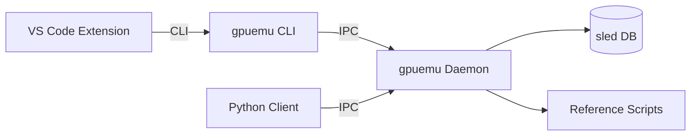

# gpuemu

**GPU-less development, assessment, and validation for deep learning kernels.**

---

gpuemu is a development and CI toolchain that lets you validate GPU-targeted deep learning kernels **without a GPU**. It provides CPU mirror execution, deterministic fuzzing, numerical stability checks, artifact linting, and tight editor integration — all designed to catch bugs before they reach hardware.

<div class="grid cards" markdown>

-   :material-rocket-launch:{ .lg .middle } **Get Started in 5 Minutes**

    ---

    Install the CLI, Python client, and run your first validation.

    [:octicons-arrow-right-24: Quick Start](getting-started/quickstart.md)

-   :material-cog:{ .lg .middle } **Flexible Configuration**

    ---

    Configure tolerances, dtypes, invariants, and policies via `gpuemu.toml`.

    [:octicons-arrow-right-24: Configuration](getting-started/configuration.md)

-   :material-test-tube:{ .lg .middle } **Framework Support**

    ---

    First-class adapters for PyTorch, JAX, and TensorFlow.

    [:octicons-arrow-right-24: Tutorials](tutorials/pytorch-validation.md)

-   :material-microsoft-visual-studio-code:{ .lg .middle } **VS Code Integration**

    ---

    Live diagnostics, code actions, test explorer, and on-save validation.

    [:octicons-arrow-right-24: VS Code Guide](guides/vscode-extension.md)

</div>

## What gpuemu Does

- **CPU Mirror Execution** — Run your kernel logic on CPU with deterministic inputs, then compare against a reference implementation.
- **Shape & Layout Fuzzing** — Automatically test across batch sizes, sequence lengths, hidden dimensions, and memory layouts with reproducible seeds.
- **Numerical Stability Checks** — Per-dtype tolerances, NaN/Inf detection, and invariant enforcement (non-negativity, shape preservation).
- **Artifact Linting** — Inspect PTX/SASS for register pressure, spills, local memory usage, and forbidden instruction patterns.
- **CI-First Workflow** — Deterministic tests with seed-based reproduction, JUnit/JSON output, and GitHub Actions/GitLab CI templates.
- **Cross-Language RNG** — Bit-for-bit identical xorshift128+ PRNG in Rust and Python for reproducible failures.
- **Editor Integration** — VS Code extension with Problems panel, code actions (reproduce/minimize), test explorer, and on-save validation.

## What gpuemu Is Not

!!! note
    gpuemu is **not** a cycle-accurate GPU emulator. It does not simulate GPU hardware, measure performance, or replace on-device benchmarking. It validates *correctness* of kernel logic on CPU.

## Architecture Overview

gpuemu has four components that work together:



| Component | Role |
|-----------|------|
| **Daemon** (`gpuemu-daemon`) | IPC server handling validation, fuzzing, artifact analysis, and storage |
| **CLI** (`gpuemu`) | Command-line interface for daemon control, testing, fuzzing, and CI |
| **Python Client** (`gpuemu-py`) | Programmatic validation with PyTorch/JAX/TensorFlow adapters |
| **VS Code Extension** | Editor integration with diagnostics, code actions, and test explorer |

## Supported Frameworks

=== "PyTorch"

    ```python
    from gpuemu_py.frameworks.pytorch import validate_pytorch

    with validate_pytorch(client, "my_op", {"x": x}) as ctx:
        ctx["output"] = my_custom_op(x)
    ```

=== "JAX"

    ```python
    from gpuemu_py.frameworks.jax import validate_jax

    with validate_jax(client, "my_op", {"x": x}) as ctx:
        ctx["output"] = my_custom_op(x)
    ```

=== "TensorFlow"

    ```python
    from gpuemu_py.frameworks.tensorflow import validate_tensorflow

    with validate_tensorflow(client, "my_op", {"x": x}) as ctx:
        ctx["output"] = my_custom_op(x)
    ```

## Platform Support

| Platform | Status | Notes |
|----------|--------|-------|
| **Linux** | Primary | Full workflow including artifact inspection |
| **macOS** | Core | CPU validation works fully; artifact inspection optional |
| **Windows** | Future | Not currently targeted |

## Next Steps

- [Install gpuemu](getting-started/installation.md) and run your first validation
- Read the [Architecture](concepts/architecture.md) overview to understand the system
- Follow a framework tutorial: [PyTorch](tutorials/pytorch-validation.md), [JAX](tutorials/jax-validation.md), or [TensorFlow](tutorials/tensorflow-validation.md)
- Set up [CI integration](tutorials/ci-integration.md) for your project
